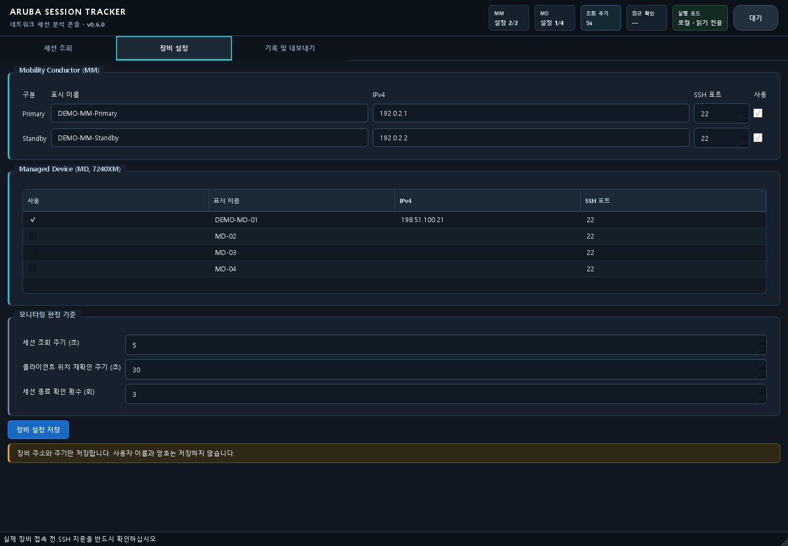
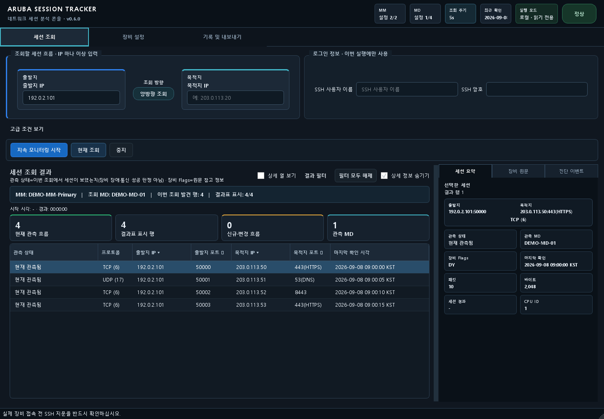
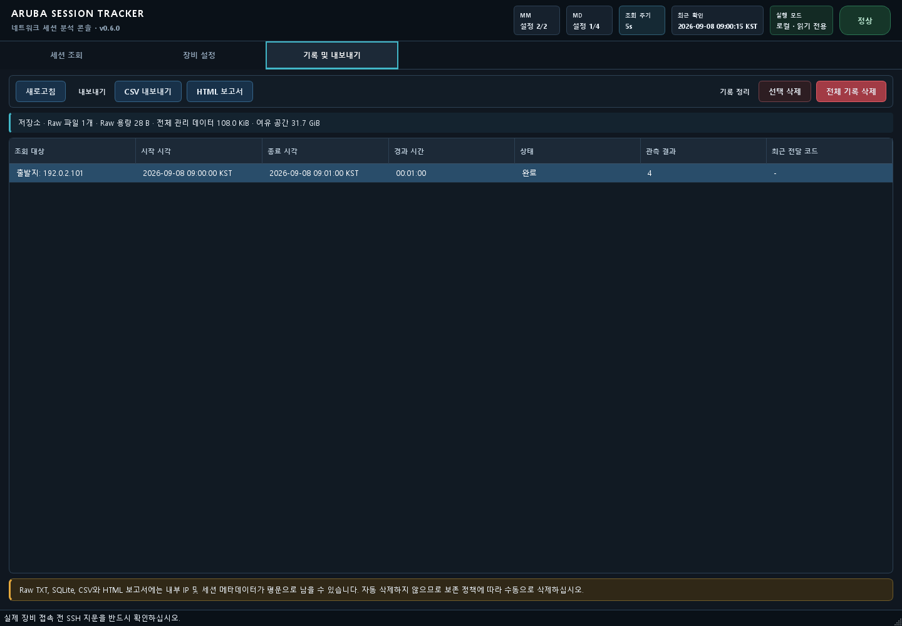
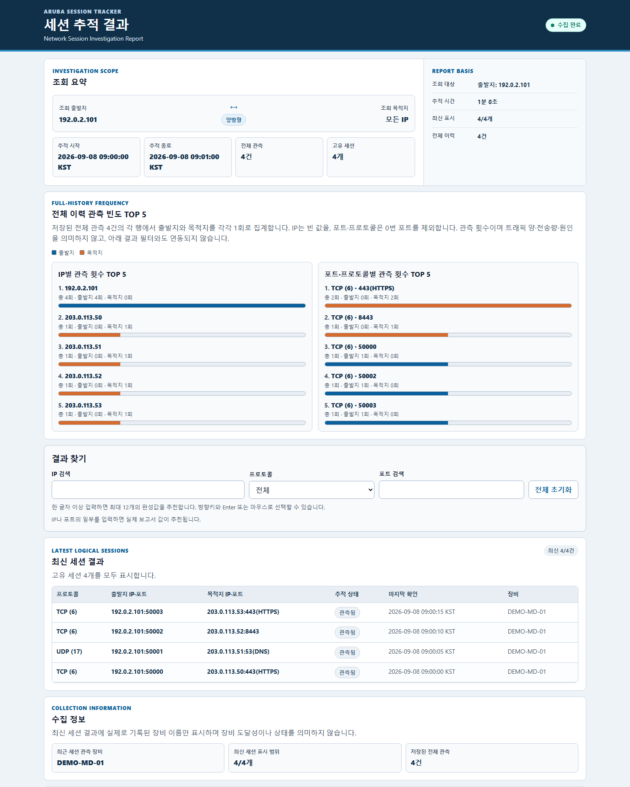

# 화면으로 따라가는 세션 조사

이 문서는 **v0.6.0 실제 Qt 앱과 HTML 보고서 렌더러**에 문서용 합성 데이터를 넣어 만든 사용 흐름입니다. 화면을 따로 그린 목업이 아닙니다. 캡처는 장비 조회를 수행하지 않았으며, 표시된 IP·장비명·시간·관측값은 모두 예시입니다. 실제 장비에서 실행하기 전에는 조직의 조회 권한과 호스트 키를 확인하십시오.

## 1. 조사할 장비 범위 확인



- **사용 행동:** `장비 설정`에서 Primary/Standby Mobility Conductor와 사용 대상으로 체크한 MD를 확인합니다.
- **읽을 값:** 관리 IP·SSH 포트·사용 여부, 조회 주기와 종료 기준을 확인합니다. 예시는 문서용 주소의 MD 1대만 사용합니다.
- **다음 행동:** `세션 조회`로 이동해 조사할 IPv4 조건을 입력합니다. 사용자 이름·비밀번호는 세션에서만 사용하며 이 캡처에서는 비워 두었습니다.

## 2. 세션 행과 선택한 흐름 해석



- **사용 행동:** 출발지/목적지 중 하나 이상의 IPv4를 입력하고 필요하면 고급 조건에서 포트를 제한합니다. `현재 조회`는 1회, `지속 모니터링 시작`은 반복 관측입니다.
- **읽을 값:** 조회 범위의 MM/MD, 프로토콜과 양 끝 IP·포트, 현재 관측 상태를 함께 읽습니다. 예시는 출발지 `192.0.2.101`의 합성 4행입니다. `상세 정보 보기`에서 선택한 행의 상세·Raw·진단으로 근거를 좁힙니다.
- **다음 행동:** 반복 관측이 필요하면 동일한 조건으로 모니터링합니다. `현재 관측됨`은 세션 행을 보았다는 뜻이며 통신 성공·장비 정상 판정이 아닙니다. `HTTPS` 등 이름은 포트 번호에 따른 대표 서비스 후보입니다.

상단 양방향 흐름 표시는 **조회 조건**입니다. 실제 경유 장비나 라우팅 경로를 측정한 그림이 아닙니다. 캡처는 조회 버튼을 실행하지 않고 실제 화면의 결과 표시 함수에 `QueryOutcome`을 주입했습니다. 이 화면 자체는 SSH·파서·수집 성공의 증거가 아닙니다.

## 3. 기록을 골라 결과 내보내기



- **사용 행동:** `기록 및 내보내기`에서 실행을 선택합니다. CSV와 HTML은 별도 내보내기 경로입니다.
- **읽을 값:** 실행 조건·시작/종료·상태·관측 수를 먼저 확인합니다. 예시는 임시 SQLite에 저장한 1분 실행, 4개 관측입니다. `완료`는 수집 실행 상태이며 장애 해결을 뜻하지 않습니다.
- **다음 행동:** 조사 목적에 맞춰 결과 파일을 저장한 뒤 공유 전 IP 등 민감정보를 점검합니다. 오른쪽 삭제 동작은 내보내기와 다른 작업입니다.

이력 위쪽 저장소 용량·여유 공간은 임시 합성 저장소와 CI 러너의 로컬 디스크 값이며 사용자 PC의 값이 아닙니다. 조회 화면의 작은 최근 확인 카드와 시작시각 행 일부는 이 캡처에서 잘려 보이므로, 정확한 시간은 이력 표와 보고서에서 확인합니다.

## 4. 독립 HTML 조사 보고서 읽기



- **사용 행동:** 내보낸 단일 HTML을 브라우저에서 엽니다. 화면은 실제 export 결과를 Windows Edge로 렌더한 **상단 1440×1800 영역**입니다. 하단의 접힌 전체 이력은 이 이미지 밖에 있습니다.
- **읽을 값:** 조회 범위·KST 시간·전체 관측·고유 세션을 먼저 읽고, 최신 세션 표와 결과 찾기로 흐름을 좁힙니다. TOP 5는 저장된 전체 이력의 출발지/목적지 관측 빈도이며 트래픽 양·전송량이 아닙니다. 결과 필터를 적용해도 TOP 5의 집계 기준은 바뀌지 않습니다.
- **다음 행동:** IP/포트는 실제 값 선택 또는 정확한 값 입력 후 Enter로 필터를 확정합니다. 필터 표시 수와 전체 수를 비교하고, 필터를 초기화하면 전체 이력을 다시 볼 수 있습니다.

이 문서에는 PNG만 공개합니다. 실제 운영 HTML, SQLite, Raw 출력, 계정 정보를 저장소에 올리지 않습니다.

## 캡처 출처와 재현

캡처 소스: `543f8ec4e24d623601dbe8d9bc050570bb078a58`. [Windows 생성 실행 34175800866](https://github.com/sebia1993/aruba-session-tracker-1/actions/runs/34175800866)에서 4개 PNG를 내려받아 직접 검토했습니다.

- 앱 버전: **0.6.0**. 캡처 소스 SHA·실행 ID·PNG 크기·SHA-256은 [capture-metadata.json](images/capture-metadata.json)에 기록합니다.
- 도구: [render_docs_screenshots.py](../tools/render_docs_screenshots.py), [Windows 캡처 workflow](../.github/workflows/docs-screenshots.yml).
- 환경: GitHub Actions `windows-latest`가 선택한 **Windows Server 2025**, CPython 3.13.15 x64, PySide6 6.11.0, Qt offscreen 100%, Windows 내장 Malgun Gothic. 물리 Windows 11 데스크톱 캡처와 구분합니다.
- 데이터 경로: 임시 ConfigRepository/SessionStore → 합성 QueryOutcome → 실제 MainWindow / 실제 HTML export → PNG. 실제 RuntimeExecutor를 만들지 않고 Python socket 연결도 차단합니다. 임시 DB·Raw·HTML은 종료 시 제거합니다.

저장소 루트의 Windows PowerShell에서:

```powershell
py -3.13 -m venv .venv
.\.venv\Scripts\python.exe -m pip install -r requirements-runtime.lock
$env:PYTHONPATH = "src"
$env:QT_QPA_PLATFORM = "offscreen"
$env:QT_SCALE_FACTOR = "1"
.\.venv\Scripts\python.exe tools/render_docs_screenshots.py --output artifacts/docs-screenshots --include-report
```

`--include-report`는 Windows Edge를 사용합니다. workflow의 `usage-screenshots-windows` artifact에는 PNG와 출처 JSON만 들어갑니다. 새 캡처를 공개할 때는 내려받은 이미지를 직접 확인한 뒤 README와 이 문서를 함께 갱신합니다. macOS는 현재 소스의 Windows 전용 모듈 때문에 이 경로를 실행할 수 없습니다.

캡처 생성 성공은 레이아웃·출처 증거입니다. 기능·패키지 검증은 별도 [Windows CI](https://github.com/sebia1993/aruba-session-tracker-1/actions/workflows/ci.yml), 실제 장비/회사 PC 검증 한계는 [포트폴리오 사례](PORTFOLIO_KO.md)에서 확인합니다.
